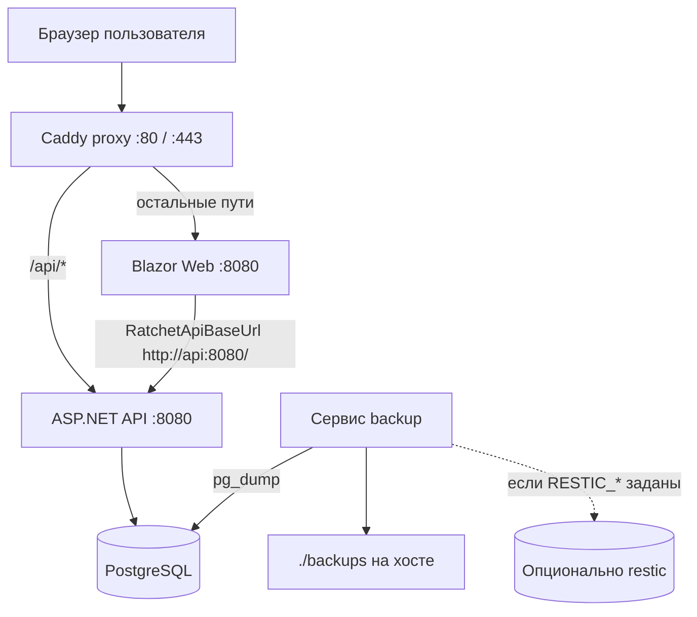

# Подготовка к релизу: документация по проделанной работе

Документ описывает изменения, сделанные для вывода WWS Ratchet в self hosted продакшен. Цель: чтобы через месяц или год можно было быстро вспомнить, **что** сделано, **где** лежит код и **как** этим пользоваться.

Краткая инструкция по запуску остаётся в [README.md](../README.md). Здесь фокус на архитектуре решений и деталях реализации.

---

## Содержание

1. [Обзор](#обзор)
2. [Схема деплоя](#схема-деплоя)
3. [Секреты и конфигурация](#секреты-и-конфигурация)
4. [Архив и удаление](#архив-и-удаление)
5. [Безопасность загрузки логотипа](#безопасность-загрузки-логотипа)
6. [Тесты xUnit](#тесты-xunit)
7. [Docker и контейнеризация](#docker-и-контейнеризация)
8. [Health checks](#health-checks)
9. [Reverse proxy (Caddy)](#reverse-proxy-caddy)
10. [Автобэкапы PostgreSQL](#автобэкапы-postgresql)
11. [Справочник файлов](#справочник-файлов)
12. [Типичные проблемы](#типичные-проблемы)

---

## Обзор

Работа закрывала план «подготовка к релизу» для self hosted развёртывания (Application Web Worker: API + Blazor Web в Docker, без облачного AWS).

| Блок | Статус | Суть |
|------|--------|------|
| Секреты в env | Готово | Пароли и seed только через переменные окружения |
| Архив / удаление | Готово | Мягкий архив `IsArchived`, жёсткое удаление только для пустых записей |
| Безопасность логотипа | Готово | Проверка magic bytes PNG/JPEG/WebP |
| Тесты xUnit | Готово | 28 тестов, unit + интеграционные |
| Docker | Готово | Dockerfile API/Web, `docker-compose.yml` |
| Health + proxy | Готово | `/health`, `/health/ready`, Caddy |
| Автобэкапы | Готово | pg_dump, ротация, опционально restic |

**Не входило в план:** GitHub Actions CI, облачный деплой AWS.

---

## Схема деплоя



**Важно:** Blazor Server ходит в API **с сервера** (контейнер `web` → контейнер `api`), а не из браузера. Поэтому в Docker `RatchetApiBaseUrl=http://api:8080/`. Браузер видит только Caddy на одном домене.

Для локальной разработки в IDE по прежнему используется `WerkonWebServicesRatchet/compose.yaml` (только PostgreSQL) и два проекта в Visual Studio.

---

## Секреты и конфигурация

### Принцип

Секреты **не хранятся** в `appsettings.json` (production). Источники:

| Среда | Где задавать |
|-------|----------------|
| Docker Compose | Файл `.env` в корне репозитория (не в git) |
| Локальная IDE | `WerkonWebServicesRatchet/appsettings.Development.json` |
| Шаблон | `.env.example` (в git, без реальных паролей) |

### Ключевые переменные

| Переменная | Назначение |
|------------|------------|
| `POSTGRES_PASSWORD` | Пароль PostgreSQL в контейнере |
| `ConnectionStrings__DefaultConnection` | Строка подключения API (в Docker хост `postgres`) |
| `Seed__AdminUserName` | Логин seed админа |
| `Seed__AdminPassword` | Пароль seed админа (обязателен, если админа ещё нет) |
| `Seed__AdminDisplayName` | Отображаемое имя админа |
| `DisableHttpsRedirection` | `true` в Docker (TLS на Caddy, внутри HTTP) |
| `RatchetApiBaseUrl` | URL API для Blazor (в Docker: `http://api:8080/`) |

### Поведение при старте API

1. `Program.cs` требует `ConnectionStrings__DefaultConnection`, иначе приложение падает с понятной ошибкой.
2. `IdentitySeedHostedService` применяет миграции EF Core, создаёт роли и seed админа.
3. Если пользователь `Seed__AdminUserName` не существует и `Seed__AdminPassword` пуст, старт падает с ошибкой (нельзя случайно поднять API без пароля админа).

### Gitignore

В `.gitignore` добавлены: `.env`, `.env.*` (кроме `.env.example`), каталог `/backups/`.

---

## Архив и удаление

### Зачем

Клиент, автомобиль и визит нельзя просто удалить: на них висят связанные данные (визиты, работы, напоминания, журнал). Решение: **мягкий архив** + жёсткое удаление только когда связей нет.

### Модель данных

Сущности `Client`, `Vehicle`, `Visit` получили поля:

- `IsArchived` (bool, по умолчанию `false`)
- `ArchivedAtUtc` (DateTime?, заполняется при архивации)

Миграция: `Migrations/20260612033605_AddArchiveFlags.cs`.

Каталог услуг по прежнему использует `IsActive` (деактивация). Статус визита `Cancelled` и закрытие напоминаний не менялись.

### Глобальный фильтр EF Core

В `AppDbContext` для Client, Vehicle, Visit:

```csharp
entity.HasQueryFilter(x => !x.IsArchived);
```

Архивные записи **не попадают** в обычные запросы. Чтобы увидеть архивные, в коде используется `.IgnoreQueryFilters()`.

### API

| Сущность | Архив | Восстановление | Жёсткое удаление |
|----------|-------|----------------|------------------|
| Client | `PATCH /api/clients/{id}/archive` | `PATCH .../restore` | `DELETE ...` (только admin, без автомобилей) |
| Vehicle | `PATCH /api/vehicles/{id}/archive` | `PATCH .../restore` | `DELETE ...` (только admin, без визитов и напоминаний) |
| Visit | `PATCH /api/visits/{id}/archive` | `PATCH .../restore` | `DELETE ...` (только admin, без service items) |

Список клиентов: параметр `includeArchived=true` показывает и архивные.

Детальные эндпоинты (`GetById`, `GetDetails`) используют `IgnoreQueryFilters()`, чтобы карточку архивной записи можно было открыть и восстановить.

### UI (Blazor)

- Список клиентов: чекбокс «Показать архивные», бейдж «В архиве».
- Карточки клиента, автомобиля, визита: кнопки «Архивировать» / «Восстановить».
- На архивном визите скрыты редактирование, назначение механика, закрытие визита, добавление напоминания.

Локализация ключей: `Archive_Badge`, `Archive_ShowArchived`, `Archive_Archive`, `Archive_Restore`, `History_Action_Archived`, `History_Action_Restored`.

### Аудит

В `AuditActions` добавлены `Archived` и `Restored`. `AuditEntryFactory` при изменении только `IsArchived` пишет соответствующее действие в журнал (не generic `Updated`).

### Web клиент

`RatchetApiClient`: методы `ArchiveClientAsync`, `RestoreClientAsync`, `DeleteClientAsync` (и аналоги для vehicle, visit).

---

## Безопасность загрузки логотипа

**Файл:** `Infrastructure/Settings/AppSettingsService.cs`, метод `UploadOrganizationLogoAsync`.

Раньше проверялись только `ContentType` и размер. Теперь после декодирования base64 вызывается `DetectImageContentType(byte[])`:

| Формат | Magic bytes |
|--------|-------------|
| PNG | `89 50 4E 47 0D 0A 1A 0A` |
| JPEG | `FF D8 FF` |
| WebP | `RIFF` + `WEBP` на позиции 8 |

Правила:

1. Если сигнатура не распознана → ошибка «not a valid PNG, JPEG, or WebP».
2. Если сигнатура не совпадает с заявленным `ContentType` → ошибка «does not match».

Лимит размера: 512 KB (`MaxLogoBytes`).

Тесты: `WerkonWebServicesRatchet.Tests/LogoSignatureTests.cs`.

---

## Тесты xUnit

**Проект:** `WerkonWebServicesRatchet.Tests` (добавлен в `WerkonWebServicesRatchet.slnx`).

Запуск:

```bash
dotnet test WerkonWebServicesRatchet.Tests/WerkonWebServicesRatchet.Tests.csproj
```

### Покрытие

| Файл | Что проверяет |
|------|----------------|
| `AppTimeZoneTests` | Границы дня Moscow, UTC↔local, fallback таймзоны |
| `VisitTotalAmountTests` | Сумма `TotalAmount` в деталях визита |
| `ReminderDueTests` | Фильтр напоминаний по дню, хранение `ReminderAtUtc` |
| `ClientValidationTests` | Обязательные поля клиента, trim |
| `ArchiveTests` | Фильтр архива, restore, delete с конфликтом, аудит |
| `LogoSignatureTests` | Валидный PNG, поддельный content type |
| `Integration/ApiSecurityTests` | 401 без auth, неуспешный login |
| `Integration/RatchetApiFactory` | WebApplicationFactory + InMemory БД |

Интеграционные тесты подменяют PostgreSQL на EF InMemory и отключают `IdentitySeedHostedService` (миграции не нужны в тестах).

API экспортирует `public partial class Program` в конце `Program.cs` для `WebApplicationFactory<Program>`.

---

## Docker и контейнеризация

### Файлы

| Файл | Назначение |
|------|------------|
| `WerkonWebServicesRatchet/Dockerfile` | Multi stage сборка API |
| `WerkonWebServicesRatchet.Web/Dockerfile` | Multi stage сборка Web |
| `.dockerignore` | Исключает bin/obj/.git/.env/backups |
| `docker-compose.yml` | Полный стек в корне репозитория |
| `WerkonWebServicesRatchet/compose.yaml` | Только PostgreSQL для разработки в IDE |

### Запуск полного стека

```bash
cp .env.example .env
# заполнить пароли
docker compose up -d --build
```

Первый запуск: `powershell -ExecutionPolicy Bypass -File docker\setup-hosts.ps1` (PowerShell от администратора).

Открыть в браузере: **`http://ratchet.local`**

### Порядок старта

```
postgres (healthy) → api (healthy /health/ready) → web (healthy) → proxy, backup
```

### Внутренние URL

| Сервис | Порт внутри сети | Снаружи |
|--------|------------------|---------|
| postgres | 5432 | не публикуется |
| api | 8080 | не публикуется |
| web | 8080 | не публикуется |
| proxy | 80, 443 | HTTP_PORT, HTTPS_PORT |

---

## Health checks

### API

Регистрация в `Program.cs`:

```csharp
builder.Services.AddHealthChecks()
    .AddDbContextCheck<AppDbContext>("database", tags: ["ready"]);
```

| Эндпоинт | Назначение | Проверка БД |
|----------|------------|-------------|
| `GET /health` | Liveness | Нет (процесс жив) |
| `GET /health/ready` | Readiness | Да (EF DbContext) |

Docker healthcheck API использует `/health/ready`.

### Web

`GET /health` → `200 OK` (минимальная проверка, БД не нужна).

### Зачем это нужно

- Compose не пускает `api`, пока PostgreSQL не готов.
- Compose не пускает `web`, пока API не отвечает на readiness.
- При зависании контейнер можно перезапустить по failed healthcheck.
- Прокси и мониторинг могут опрашивать те же URL.

---

## Reverse proxy (Caddy)

**Конфиг:** `docker/Caddyfile`

```
/api/*  →  api:8080
/*      →  web:8080
```

Переменные окружения:

| Переменная | Локально | Продакшен |
|------------|----------|-----------|
| `CADDY_ADDRESS` | `ratchet.local` | `ratchet.local` (тот же адрес в LAN) |
| `CADDY_GLOBAL_OPTIONS` | `auto_https off` | пусто (авто TLS) |

Только контейнер `proxy` публикует порты наружу. API и PostgreSQL недоступны напрямую из интернета.

`DisableHttpsRedirection=true` на API и Web, потому что TLS терминируется на Caddy, внутри сети HTTP.

---

## Автобэкапы PostgreSQL

**Каталог:** `docker/backup/`

| Файл | Назначение |
|------|------------|
| `Dockerfile` | Образ на базе postgres:17-alpine + restic |
| `backup.sh` | Логика дампа и ротации |
| `entrypoint.sh` | Цикл: backup → sleep N секунд |
| `restore-test.sh` | Проверка восстановления в временную БД |

### Что делает backup

1. `pg_dump` → `gzip` → `./backups/daily/ratchet-YYYYMMDDTHHMMSSZ.sql.gz`
2. Удаляет daily старше 7 дней (настраивается `DAILY_RETENTION_DAYS`)
3. По воскресеньям (UTC) копирует в `weekly/`, хранит 4 недели (`WEEKLY_RETENTION_WEEKS`)
4. Если заданы `RESTIC_REPOSITORY` и `RESTIC_PASSWORD`: шифрованный снапшот в restic

Интервал по умолчанию: 86400 сек (24 часа), переменная `BACKUP_INTERVAL_SECONDS`.

### Защита от шифровальщика (рекомендации)

Реализовано в коде:

- Локальные дампы с ротацией (не бесконечный рост).
- Опциональный **restic** (шифрование, отдельное хранилище).

Рекомендуется оператору:

1. **Правило 3-2-1:** 3 копии, 2 носителя, 1 вне сервера.
2. Restic репозиторий на S3 с **Object Lock** / immutability (WORM), куда у сервера нет прав на удаление.
3. Пароль restic хранить отдельно от `.env` на сервере.
4. Регулярно запускать проверку восстановления:

```bash
docker compose exec backup sh /usr/local/bin/restore-test.sh
```

Скрипт создаёт БД `ratchet_restore_test`, восстанавливает последний daily дамп, считает таблицы, удаляет тестовую БД.

---

## Справочник файлов

### Новые и ключевые файлы по блокам

**Секреты**
- `.env.example`, `.gitignore`
- `WerkonWebServicesRatchet/appsettings.json` (без секретов)
- `WerkonWebServicesRatchet/appsettings.Development.json` (локальные дефолты)
- `Program.cs`, `IdentitySeedHostedService.cs`

**Архив**
- `Domain/Entities/Client.cs`, `Vehicle.cs`, `Visit.cs`
- `Infrastructure/Persistence/AppDbContext.cs`
- `Features/Clients/ClientsController.cs`, `Vehicles/`, `Visits/`
- `Infrastructure/Audit/AuditActions.cs`, `AuditEntryFactory.cs`
- `Web/Components/Pages/Clients/`, `Vehicles/`, `Visits/`
- `Web/Services/RatchetApiClient.cs`
- `Web/Localization/LocalizedStrings.cs`

**Docker / infra**
- `docker-compose.yml`, `docker/Caddyfile`, `docker/backup/*`
- `WerkonWebServicesRatchet/Dockerfile`, `WerkonWebServicesRatchet.Web/Dockerfile`

**Тесты**
- `WerkonWebServicesRatchet.Tests/**`

**Пагинация (ранее)**
- `.cursor/rules/list-pagination.mdc` — конвенция infinite scroll для новых списков

---

## Типичные проблемы

### API не стартует в Docker

- Проверь `.env`: `ConnectionStrings__DefaultConnection`, `Seed__AdminPassword`.
- Логи: `docker compose logs api`
- Дождись `postgres` healthy: `docker compose ps`

### 502 от Caddy

- `api` или `web` ещё не healthy: `docker compose ps`
- Проверь readiness: `docker compose exec api curl -f http://localhost:8080/health/ready`

### Логин не работает после деплоя

- Seed админ создаётся только при **первом** старте, если пользователя нет.
- Пароль из `Seed__AdminPassword` в `.env` (не из старого `Admin123!` из README).

### Архивная запись «не найдена»

- Обычные запросы фильтруют `IsArchived`. Для списка клиентов включи `includeArchived=true`.
- Детальная карточка должна открываться по прямой ссылке (там `IgnoreQueryFilters`).

### Бэкапы пустые

- Подожди первый цикл (`BACKUP_INTERVAL_SECONDS`) или запусти вручную:
  `docker compose exec backup sh /usr/local/bin/backup.sh`
- Проверь права на `./backups` на хосте.

### Тесты не собираются

- В `.csproj` тестов должен быть `<Using Include="Xunit" />`.
- Запуск: `dotnet test WerkonWebServicesRatchet.Tests/WerkonWebServicesRatchet.Tests.csproj`

---

## История изменений (кратко)

| Дата (ориентир) | Изменение |
|-----------------|-----------|
| 2026-06 | Infinite scroll для всех списков из БД |
| 2026-06 | План release readiness: секреты, архив, тесты, Docker, health, бэкапы |
| Миграция `AddArchiveFlags` | Поля архива на Client, Vehicle, Visit |

---

*Документ актуален на момент завершения плана подготовки к релизу. При добавлении новых фич обновляй соответствующие разделы.*
